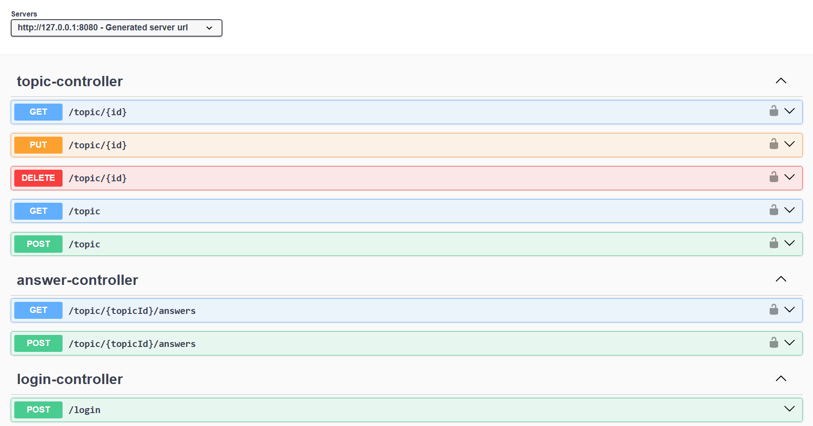

# forohub-alura
A forum platform with REST API architecture

## 💻 Sobre el proyecto

Es una aplicación web con la arquitectura de API REST que implementa los foros
para los cursos de una plataforma de cursos en línea, y en la cual, los usuarios
puede registrarse, crear tópicos y responder a los creados por otros usuarios.

---

## ⚙️ Funcionalidades

- [x] CRUD de tópicos;
- [x] CRUD de respuestas (en desarrollo);
- [ ] CRUD de cursos;

---

## 🎨 Diseño

---

## 📄 Documentación

 

---

## 🛠 Tecnologías

Las siguientes tecnologías fueron utilizadas en el desarrollo de la API REST del
proyecto:

- **[Java 21](https://www.oracle.com/java)**
- **[Spring Boot 3](https://spring.io/projects/spring-boot)**
- **[Maven](https://maven.apache.org)**
- **[MySQL](https://www.mysql.com)**
- **[Hibernate](https://hibernate.org)**
- **[Flyway](https://flywaydb.org)**
- **[Lombok](https://projectlombok.org)**
- **[OpenAPI-Swagger](https://swagger.io/specification/)**
---

## 📝 Licencia

Proyecto propuesto por [Alura](https://www.aluracursos.com/) y desarrollado por
Víctor Tzompantzi.

---
